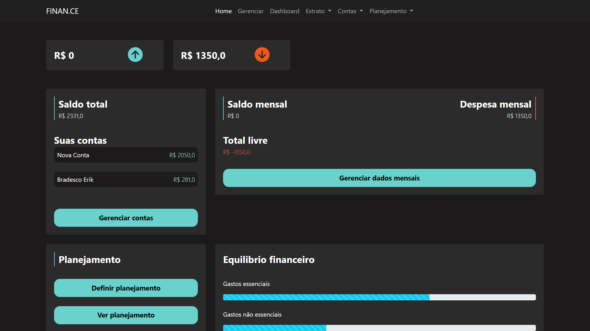
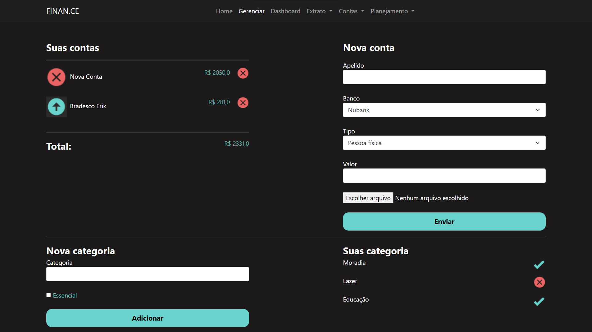
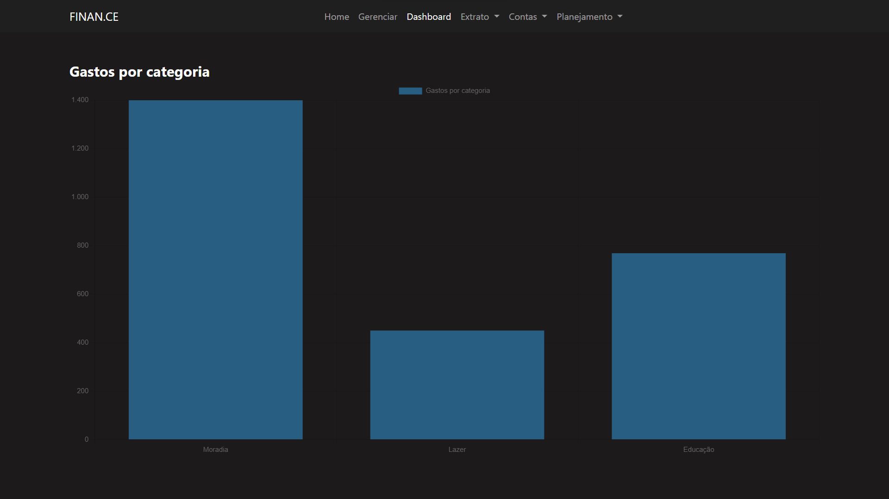
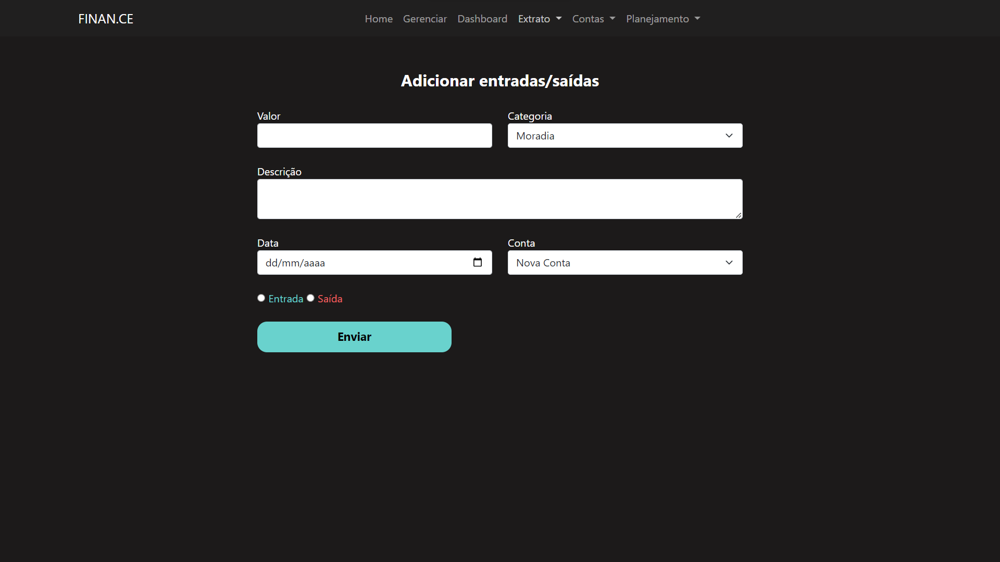
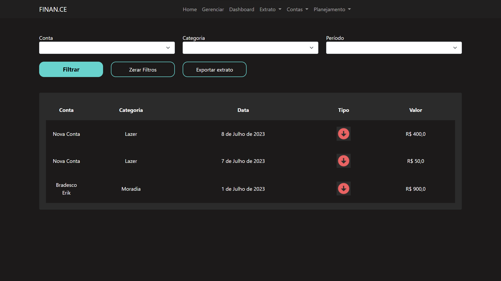
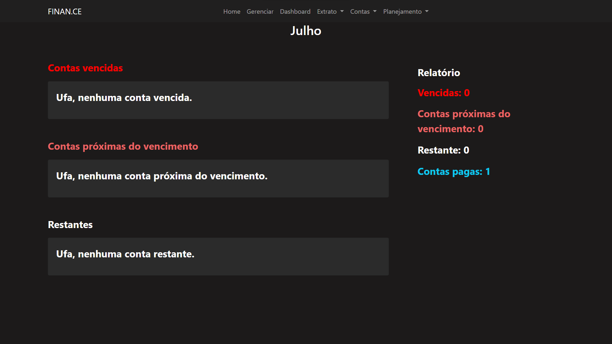
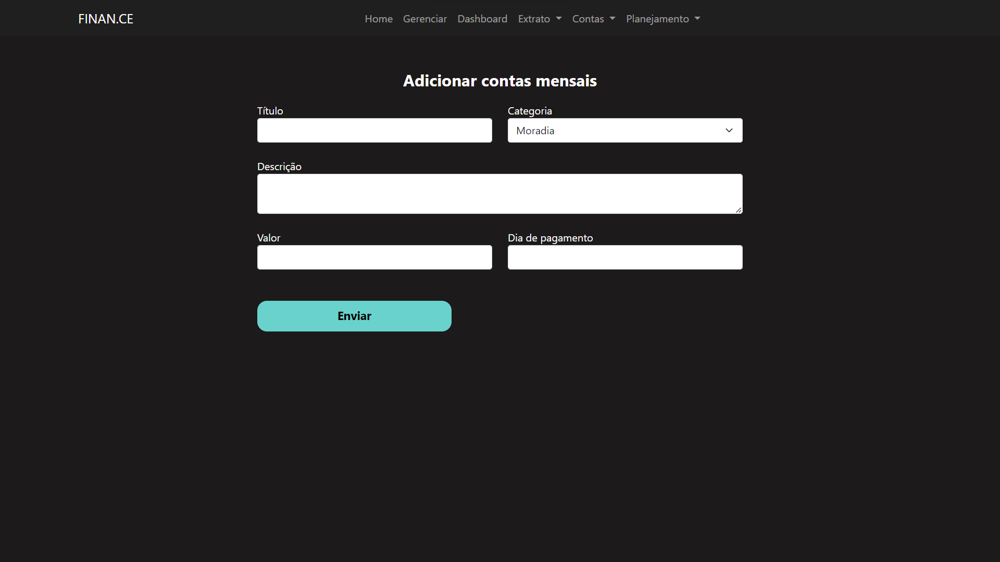
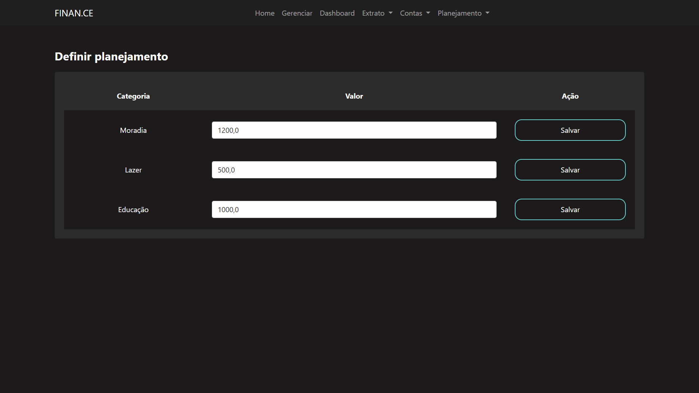
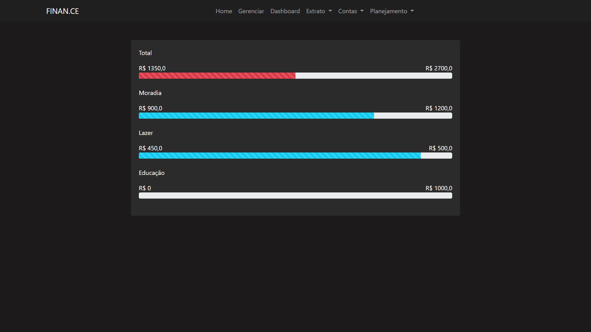

# FINAN.CE

FINAN.CE é uma aplicação WEB desenvolvida usando o framework [Django](https://www.djangoproject.com/) do Python no Backend, usando o banco de dados [SQLITE](https://www.sqlite.org/index.html) e o framewok [Bootstrap](https://getbootstrap.com/) no Frontend, além de HTML, CSS e JS. O projeto foi desenvolvido usando o modelo de arquitetura MVC (Model, View, Controler). A ideia original, design e os direitos autorais pertencem ao canal do Youtube [Pythonando](https://www.youtube.com/@pythonando). O desenvolvimento do projeto foi realizado durante o Workshop do canal, intitulado PSW 7.0 com vários tutoriais e desafios, onde todos os propostos, assim como novas features estão presentes nesse atual repositório.


## Sobre o projeto

A aplicação permite o gerenciamento das contas bancárias do usuário com telas super interativas e responsivas, sendo possível adicionar valores das contas e informações sobre as mesmas. Também é possível adicionar categorias para as entradas e saídas das contas, assim como manipular o planejamento das mesmas. Além disso, o projeto permite que seja adicionado contas/boletos a serem pagos de acordo com as categorias, assim como suas respectivas validades. E o mais interessante é que é possível ver e exportar o extrato como pdf.


## Uso

O projeto usa o ambiente virtual [venv](https://docs.python.org/3/library/venv.html) do Python, onde já está disponível o interpretador Python necessário e todas as bibliotecas importantes usadas no projeto como por exemplo o próprio DJANGO.
O primeiro passo necessário será abrir o terminal do  Visual Studio Code por meio do comando CTLR + ' e ativar a máquina virtual e usar o seguinte comando:

No Windows:
```
venv\Scripts\Activate
```
No Linux:
```
source venv/bin/activate
```
Com a máquina virtual ativa agora podemos ativar o banco de dados executando os seguintes comandos (Lembrando que por padrão o projeto utiliza o banco de dados sqlite3):

```
python manage.py makemigrations
```

```
python manage.py migrate
```

Aguarde a conclusão do comando e da criação do banco de dados e execute o servidor:

```
python manage.py runserver
```

## Todas as telas
É possível navegar por todas as telas de visualização e registro por meio da navbar presente no topo de todas as páginas.

Tela de home: 


Tela de gerenciar:


Tela de dashboard:


Tela de adicionar extrato:


Tela de ver extrato:


Tela de adicionar contas:


Tela de ver contas:


Tela de adicionar planejamento:


Tela de ver planejamento:


## Contribuições

Qualquer sugestão de melhoria ao projeto é muito bem vinda!